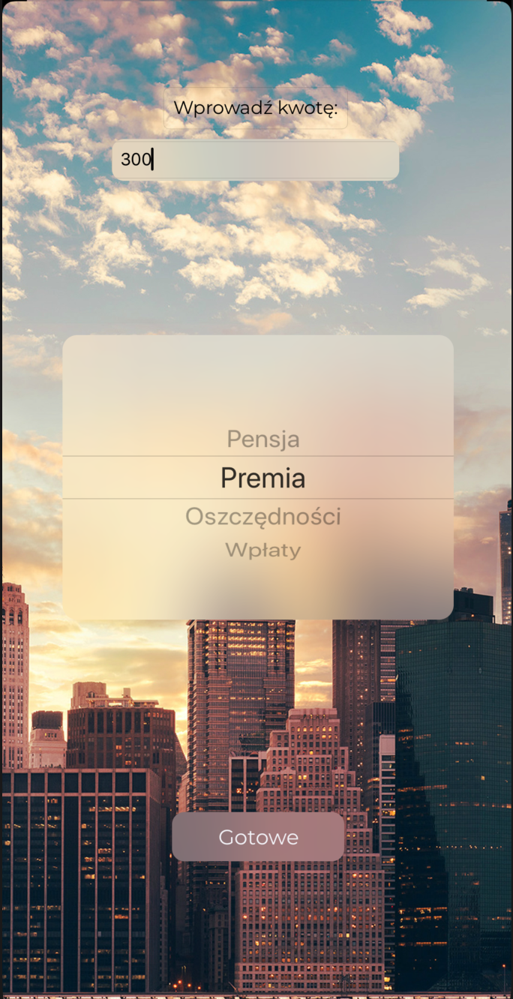

# YourBucks
"YourBucks" application is a study project for the "Mobile System Programming" subject.
The application works based on "Charts" cocoapods library.
It is designed to help control your expenses and income in individual categories by creating interactive charts. 
"YourBucks" is based on the Swift language and Xcode environment created for users of Apple mobile devices such as iPhone and iPad.  
Icons used in the application: www.flaticon.com  
Exchange rates are provided by: exchangeratesapi.io

 
     
     
     
     

